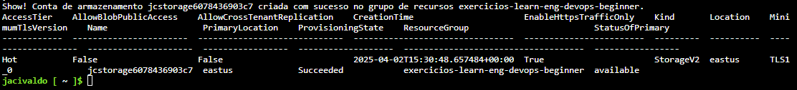
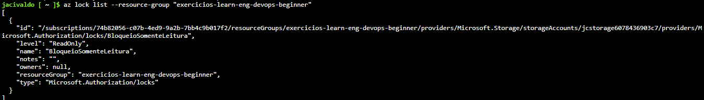
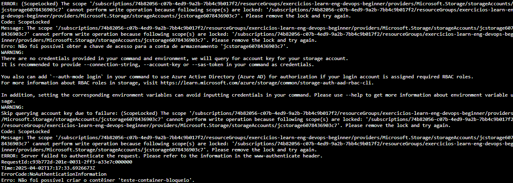
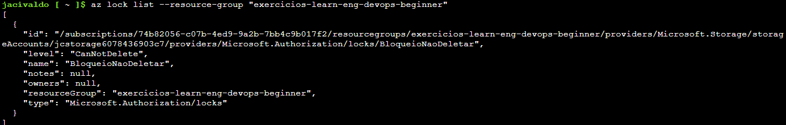
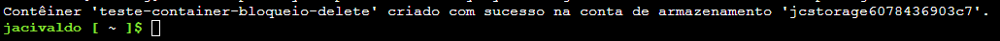
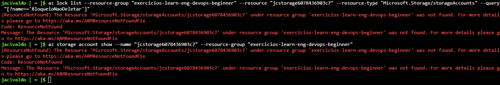

# Configuração e Gerenciamento de Bloqueios de Recursos no Azure usando scripts Bash

## Índice

- [Configuração e Gerenciamento de Bloqueios de Recursos no Azure usando scripts Bash](#configuração-e-gerenciamento-de-bloqueios-de-recursos-no-azure-usando-scripts-bash)
  - [Índice](#índice)
  - [Introdução](#introdução)
  - [Passo 1: Criar um Recurso no Azure](#passo-1-criar-um-recurso-no-azure)
    - [Resultado Esperado](#resultado-esperado)
      - [Resultados da criação do grupo de recursos e conta de armazenamento via **Cloud Shell**:](#resultados-da-criação-do-grupo-de-recursos-e-conta-de-armazenamento-via-cloud-shell)
  - [Passo 2: Aplicar um Bloqueio de Recurso ReadOnly](#passo-2-aplicar-um-bloqueio-de-recurso-readonly)
    - [Resultado Esperado](#resultado-esperado-1)
      - [Resultado da aplicação do bloqueio via **Cloud Shell**:](#resultado-da-aplicação-do-bloqueio-via-cloud-shell)
  - [Passo 3: Adicionar um Container à Conta de Armazenamento](#passo-3-adicionar-um-container-à-conta-de-armazenamento)
    - [Resultado Esperado](#resultado-esperado-2)
      - [Erro ao tentar criar o Container devido ao bloqueio:](#erro-ao-tentar-criar-o-container-devido-ao-bloqueio)
  - [Passo 4: Modificar o Bloqueio de Recurso e Criar um Container de Armazenamento](#passo-4-modificar-o-bloqueio-de-recurso-e-criar-um-container-de-armazenamento)
    - [Resultado Esperado](#resultado-esperado-3)
      - [Resultado da aplicação do bloqueio via **Cloud Shell**:](#resultado-da-aplicação-do-bloqueio-via-cloud-shell-1)
      - [Resultado após tentativa de criar o Container (com bloqueio CanNotDelete):](#resultado-após-tentativa-de-criar-o-container-com-bloqueio-cannotdelete)
  - [Passo 5: Excluir o Bloqueio e a Conta de Armazenamento](#passo-5-excluir-o-bloqueio-e-a-conta-de-armazenamento)
    - [Resultado Esperado](#resultado-esperado-4)
      - [Consultando se há recurso e bloqueio após a remoção:](#consultando-se-há-recurso-e-bloqueio-após-a-remoção)
  - [Conclusão](#conclusão)
  - [Referências](#referências)

## Introdução

Neste artigo, exploramos como configurar e gerenciar bloqueios de recursos no **Microsoft Azure**, utilizando scripts em **Bash**. Os bloqueios de recursos são uma ferramenta crucial para garantir a segurança e a integridade dos recursos da nuvem, evitando alterações não autorizadas ou acidentais em recursos críticos. O exemplo abordado neste artigo será a criação de uma conta de armazenamento, onde aplicaremos diferentes tipos de bloqueio e veremos como esses bloqueios impactam a operação da conta.

O uso de scripts Bash para automação de tarefas na nuvem facilita o gerenciamento de recursos e integrações com práticas de **DevOps** e **Infraestrutura como Código (IaC)**.


**"Este artigo foi desenvolvido com base na tarefa proposta no exercício da plataforma Microsoft Learn, disponível em: [Configurar o bloqueio de recursos no Azure](https://learn.microsoft.com/pt-br/training/modules/describe-features-tools-azure-for-governance-compliance/5-exercise-configure-resource-lock)."**


## Passo 1: Criar um Recurso no Azure

Para começar, vamos criar uma **conta de armazenamento** no Azure. O script abaixo mostra como criar um grupo de recursos e uma conta de armazenamento.

```bash
#!/bin/bash

# Definir o nome do grupo de recursos
resource_group="exercicios-learn-eng-devops-beginner"

# Gerar um nome válido para a conta de armazenamento com 24 caracteres no total
storage_account_name="jcstorage$(date +%s | tail -c 7)$(openssl rand -hex 3)"  # Exemplo: armazenamento1633028741162af84

# Certificar-se de que o nome não ultrapasse 24 caracteres
storage_account_name="${storage_account_name:0:24}"  # Limita o nome a 24 caracteres

# Definir a região padrão
location="EastUS"  # Você pode mudar para uma região específica, se necessário.

# Criar o grupo de recursos
echo "Criando o grupo de recursos $resource_group..."
az group create --name $resource_group --location $location

# Criar a conta de armazenamento
echo "Criando a conta de armazenamento $storage_account_name..."
az storage account create \
  --name $storage_account_name \
  --resource-group $resource_group \
  --location $location \
  --sku Standard_LRS \
  --kind StorageV2 
 
# Exibir detalhes sobre a conta de armazenamento criada
echo "Show! Conta de armazenamento $storage_account_name criada com sucesso no grupo de recursos $resource_group."
az storage account show --name $storage_account_name --resource-group $resource_group --output table
```

### Resultado Esperado

Após a execução desse script, o grupo de recursos e a conta de armazenamento serão criados com sucesso. O nome da conta será gerado dinamicamente, garantindo que ele tenha 24 caracteres, como exigido pelas políticas de nomenclatura do Azure.

#### Resultados da criação do grupo de recursos e conta de armazenamento via **Cloud Shell**:

<figure style="text-align: center;">
    
    <figcaption>Resultado da criação do grupo de recursos e recurso de armazenamento via Cloud Shell.</figcaption>
</figure>

## Passo 2: Aplicar um Bloqueio de Recurso ReadOnly

Agora, vamos aplicar um **bloqueio de ReadOnly** à conta de armazenamento. Esse bloqueio impede que alterações sejam feitas na conta de armazenamento, mas permite operações de leitura, como visualização de dados.

```bash
#!/bin/bash

# Defina o nome do grupo de recursos e o recurso
resource_group="exercicios-learn-eng-devops-beginner"
resource_name="jcstorage6078436903c7"
resource_type="Microsoft.Storage/storageAccounts"
lock_name="BloqueioSomenteLeitura"

# Aplicar o bloqueio de somente leitura
echo "Aplicando o bloqueio de somente leitura no recurso $resource_name..."
az lock create \
  --name "$lock_name" \
  --lock-type ReadOnly \
  --resource-group "$resource_group" \
  --resource "$resource_name" \
  --resource-type "$resource_type"

# Verificar se o bloqueio foi aplicado com sucesso
echo "Verificando o bloqueio no recurso $resource_name..."
lock_info=$(az lock list --resource-group "$resource_group" --query "[?name=='$lock_name']")

if [[ -z "$lock_info" ]]; then
  echo "O bloqueio não foi aplicado corretamente ou não foi encontrado."
else
  echo "Bloqueio aplicado com sucesso:"
  echo "$lock_info"
fi
```

### Resultado Esperado

Após aplicar o bloqueio de somente leitura, qualquer tentativa de escrita na conta de armazenamento será impedida. No entanto, você ainda poderá consultar os dados. O comando `az lock list` verifica se o bloqueio foi aplicado corretamente.

#### Resultado da aplicação do bloqueio via **Cloud Shell**:

<figure style="text-align: center;">
    
    <figcaption>Resultado da aplicação de bloqueio de leitura via shell.</figcaption>
</figure>

## Passo 3: Adicionar um Container à Conta de Armazenamento

Em seguida, tentaremos adicionar um **Container** à conta de armazenamento através do script a seguir, mas devido ao bloqueio de somente leitura aplicado no passo anterior, a operação de escrita será impedida.

```bash
#!/bin/bash

# Defina o nome da conta de armazenamento e o Container
storage_account_name="jcstorage6078436903c7"
container_name="teste-container-bloqueio"

# Obtenha a chave de acesso da conta de armazenamento
account_key=$(az storage account keys list --resource-group "exercicios-learn-eng-devops-beginner" --account-name "$storage_account_name" --query "[0].value" --output tsv)

# Verifique se a chave foi obtida com sucesso
if [[ -z "$account_key" ]]; then
  echo "Erro: Não foi possível obter a chave de acesso para a conta de armazenamento '$storage_account_name'."
fi

# Criar o Container usando a chave de acesso
create_container=$(az storage container create \
  --name "$container_name" \
  --account-name "$storage_account_name" \
  --account-key "$account_key" \
  --output none)

# Verificar se o Container foi criado com sucesso
if [[ $? -eq 0 ]]; then
  echo "Container '$container_name' criado com sucesso na conta de armazenamento '$storage_account_name'."
else
  echo "Erro: Não foi possível criar o Container '$container_name'."
fi
```

### Resultado Esperado

Ao tentar criar o Container, o erro `ScopeLocked` será gerado. Isso ocorre porque o bloqueio de somente leitura impede operações de escrita na conta de armazenamento.

#### Erro ao tentar criar o Container devido ao bloqueio:

<figure style="text-align: center;">
    
    <figcaption>Erro ao tentar criar o Container devido ao bloqueio realizado no passo 2.</figcaption>
</figure>

## Passo 4: Modificar o Bloqueio de Recurso e Criar um Container de Armazenamento

Para permitir a criação do Container, vamos remover o bloqueio de somente leitura e aplicar um bloqueio do tipo **CanNotDelete**. Esse tipo de bloqueio impede a exclusão do recurso, mas ainda permite modificações.

```bash
#!/bin/bash

# Defina o nome do grupo de recursos, recurso e bloqueio
resource_group="exercicios-learn-eng-devops-beginner"
resource_name="jcstorage6078436903c7"
resource_type="Microsoft.Storage/storageAccounts"
lock_name="BloqueioSomenteLeitura"  # Nome do bloqueio existente

# Verificar se o bloqueio já está aplicado
echo "Verificando se o bloqueio '$lock_name' existe no recurso $resource_name..."
lock_info=$(az lock list --resource-group "$resource_group" --query "[?name=='$lock_name']")

if [[ -z "$lock_info" ]]; then
  echo "Erro: O bloqueio '$lock_name' não foi encontrado."
else
  echo "Bloqueio encontrado: $lock_info"
fi

# Remover o bloqueio existente
echo "Removendo o bloqueio '$lock_name' no recurso $resource_name..."
az lock delete --name "$lock_name" --resource-group "$resource_group" --resource "$resource_name" --resource-type "$resource_type"

# Criar o novo bloqueio com tipo CanNotDelete
new_lock_name="BloqueioNaoDeletar"  # Nome do novo bloqueio
echo "Aplicando o novo bloqueio 'CanNotDelete' no recurso $resource_name..."
az lock create \
  --name "$new_lock_name" \
  --lock-type CanNotDelete \
  --resource-group "$resource_group" \
  --resource "$resource_name" \
  --resource-type "$resource_type"

# Verificar se o novo bloqueio foi aplicado com sucesso
new_lock_info=$(az lock list --resource-group "$resource_group" --query "[?name=='$new_lock_name']")

if [[ -z "$new_lock_info" ]]; then
  echo "Erro: O novo bloqueio '$new_lock_name' não foi aplicado corretamente."
else
  echo "Novo bloqueio aplicado com sucesso:"
  echo "$new_lock_info"
fi
```

### Resultado Esperado

O bloqueio de **CanNotDelete** será aplicado com sucesso, permitindo que a conta de armazenamento seja modificada, mas não excluída sem remover o bloqueio.

#### Resultado da aplicação do bloqueio via **Cloud Shell**:

<figure style="text-align: center;">
    
    <figcaption>Resultado da aplicação de bloqueio delete via shell.</figcaption>
</figure>

#### Resultado após tentativa de criar o Container (com bloqueio CanNotDelete):
Utilizando o script do passo 3 para criar um Container.
<figure style="text-align: center;">
    
    <figcaption>Resultado da criação do Container após a aplicação do bloqueio.</figcaption>
</figure>

## Passo 5: Excluir o Bloqueio e a Conta de Armazenamento

Para excluir a conta de armazenamento, precisamos remover o bloqueio aplicado e, em seguida, excluir o recurso.

```bash
#!/bin/bash

# Remover o bloqueio
echo "Removendo o bloqueio '$new_lock_name'..."
az lock delete --name "$new_lock_name" --resource-group "$resource_group" --resource "$resource_name" --resource-type "$resource_type"

# Excluir a conta de armazenamento
echo "Excluindo a conta de armazenamento $resource_name..."
az storage account delete --name "$resource_name" --resource-group "$resource_group" --yes
```

### Resultado Esperado

Após a execução do script, o bloqueio será removido, e a conta de armazenamento será excluída com sucesso.

#### Consultando se há recurso e bloqueio após a remoção:

<figure style="text-align: center;">
    
    <figcaption>Resultado da exclusão da conta de armazenamento após remoção do bloqueio.</figcaption>
</figure>

## Conclusão

A utilização de bloqueios de recursos no Azure é uma prática fundamental para proteger dados e garantir a integridade dos serviços na nuvem. O Azure oferece flexibilidade com diferentes tipos de bloqueios, como **ReadOnly** e **CanNotDelete**, que podem ser aplicados para garantir a segurança dos recursos.

A automação de processos utilizando **scripts Bash** facilita a criação, modificação e exclusão de recursos no Azure, garantindo maior eficiência, segurança e integridade nos fluxos de trabalho de administração de nuvem.

## Referências

1. [Documentação oficial sobre bloqueios de recursos no Azure](https://learn.microsoft.com/en-us/azure/azure-resource-manager/management/lock-resources)
2. [Documentação sobre comandos da Azure CLI para gerenciamento de armazenamento](https://learn.microsoft.com/en-us/azure/storage/common/storage-account-management?tabs=azure-cli)
3. [Bash no Azure: Automação de tarefas](https://learn.microsoft.com/en-us/azure/azure-cli/azure-cli-commands)